- [Macroeconomics](#macroeconomics)
  - [Chapter 2 : 收入-支出模型](#chapter-2--收入-支出模型)
    - [有效需求的原理和框架](#有效需求的原理和框架)
    - [两部门经济假设](#两部门经济假设)
    - [消费](#消费)
      - [消费曲线](#消费曲线)
      - [边际消费倾向MPC](#边际消费倾向mpc)
      - [平均消费倾向](#平均消费倾向)
      - [线性消费函数](#线性消费函数)
    - [储蓄](#储蓄)
      - [储蓄函数和储蓄倾向](#储蓄函数和储蓄倾向)
      - [非线性储蓄曲线](#非线性储蓄曲线)
      - [线性储蓄函数](#线性储蓄函数)
    - [投资](#投资)
      - [资本面积效益](#资本面积效益)
      - [投资的决定](#投资的决定)
      - [投资边际效率曲线](#投资边际效率曲线)
      - [投资和利率](#投资和利率)
    - [三部门经济中国民收入的决定](#三部门经济中国民收入的决定)
      - [政府需求的内容](#政府需求的内容)
      - [政府对消费需求和投资需求的影响](#政府对消费需求和投资需求的影响)
    - [四部门经济中国民收入的决定](#四部门经济中国民收入的决定)
      - [净出口](#净出口)
    - [乘数原理](#乘数原理)
      - [两部门模型](#两部门模型)
      - [三部门经济](#三部门经济)
      - [三部门经济：政府转移支付](#三部门经济政府转移支付)
      - [三部门经济：比例税](#三部门经济比例税)
      - [四部门经济模型](#四部门经济模型)
# Macroeconomics

## Chapter 2 : 收入-支出模型

均衡国民收入： 总需求和总供给处于相等状态

封闭经济下的宏观经济运行循环流程图：

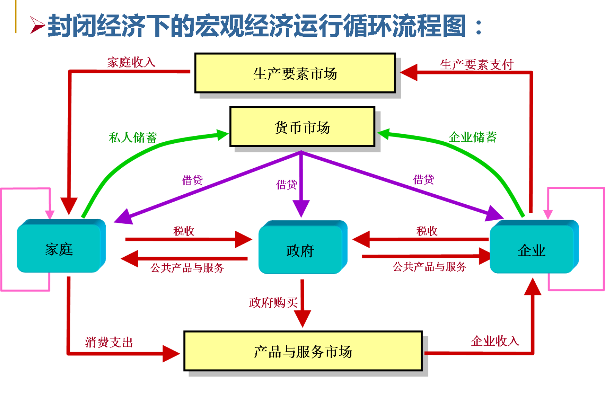

**家庭**通过提供劳动得到收入，再购买消费产品和服务以及向政府缴税支出其收入，通过货币市场进行储蓄
**企业**出售产品和服务获得收入，以后买生产要素和纳税的形式支出收入
**政府**征税获得收入，政府购买来指出收入

### 有效需求的原理和框架
基本原理：短期内主要由总需求水平决定均衡国民收入水平
有效需求由四个部分组成：
- 消费需求
- 投资需求
- 国外需求
- 政府需求

### 两部门经济假设
1. 经济中只有家庭和企业两个部门
2. 经济社会总能以不变的价格提供适应需求的产品和服务
> 凯恩斯定律：有效需求总能得到相应的供给，社会总需求的变动只会引起产量变动，不会引起价格变动
3. 社会上没有折旧和未分配利润
4. 只考虑短期
5. 投资=储蓄

因此，有公式
$Y = C + I $
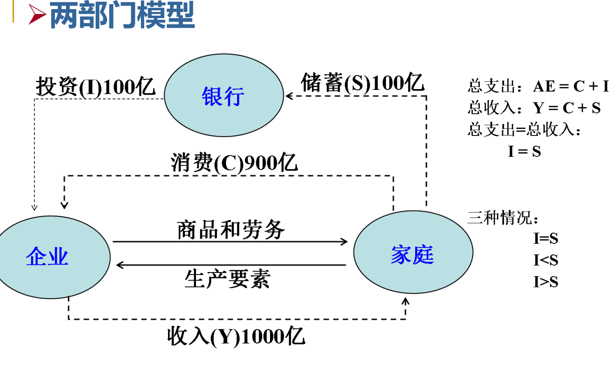

所以在均衡条件下，有：
$Y = C + I , Y = C + S$
$C + I =C + S$
$I = S$

######s 两部门经济中国民收入的决定

### 消费

消费是总需求中主要的和最大的部分，假定价格水平和其他影响因素不变，收入水平就是决定消费需求大小的最主要因素。
$C = C(Y)$
> 凯恩斯认为，随着人们收入水平增加，消费也会增加，但是消费不如收入增加的多----------消费函数

#### 消费曲线

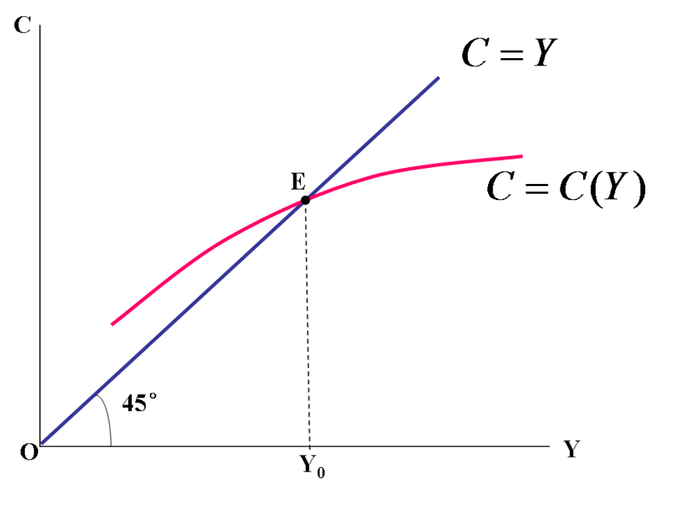

#### 边际消费倾向MPC

消费增量与收入增量的比率，即切线的斜率
$MPC = \frac{\mathrm{d}C}{\mathrm{d}Y}$

#### 平均消费倾向
$APC = \frac{C}{Y}$

#### 线性消费函数
$C = \alpha + \beta Y$
$\alpha$为自发性消费，基本消费
$\beta Y$诱致性消费

### 储蓄

#### 储蓄函数和储蓄倾向
储蓄的含义：收入中未消费的部分
$S=Y-C$
MPC递减，因此储蓄随收入增加而增加的比率就是递增的

#### 非线性储蓄曲线
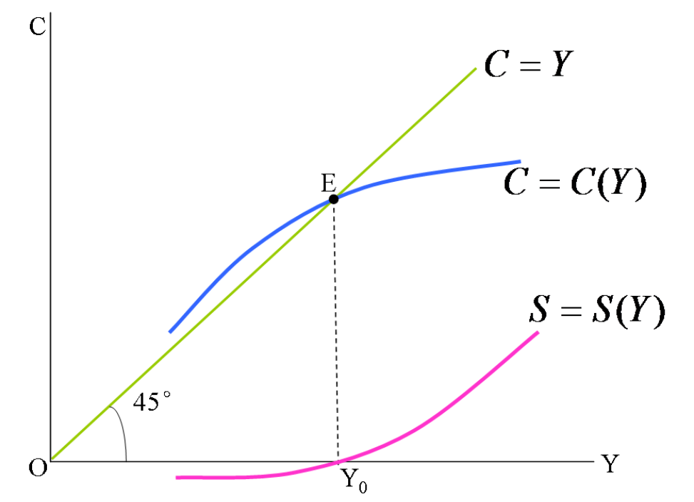

#### 线性储蓄函数
$S = -\alpha + (1-\beta)Y$
由此可以求出APS，MPS

### 投资
投资需求也是总需求的重要部分
这里的投资是实体投资，而不是金融投资
金融投资：资产所有权的转移，购买证券、土地或者其他财产
经济投资：资本的形成及社会实际资本的增加，包括厂房、机器设备和存货的增加，新住宅的建设

#### 资本面积效益
MEC，是一种贴现率，能够正好使一项资本品在试用期内预期收益的现值之和等于供给价格

#### 投资的决定
如果市场利率为r，一项资本品的边际效率为$r_c$,那么该项资本品被用于投资的条件是
$r_c > r$
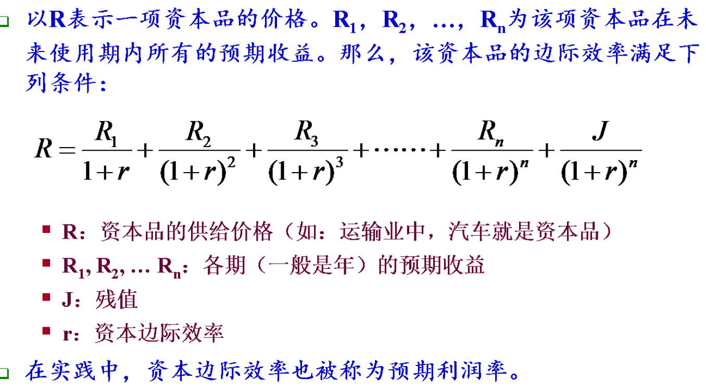

#### 投资边际效率曲线
因资本品价格上涨而导致缩小的贴现率（MEC）就叫做投资边际效率
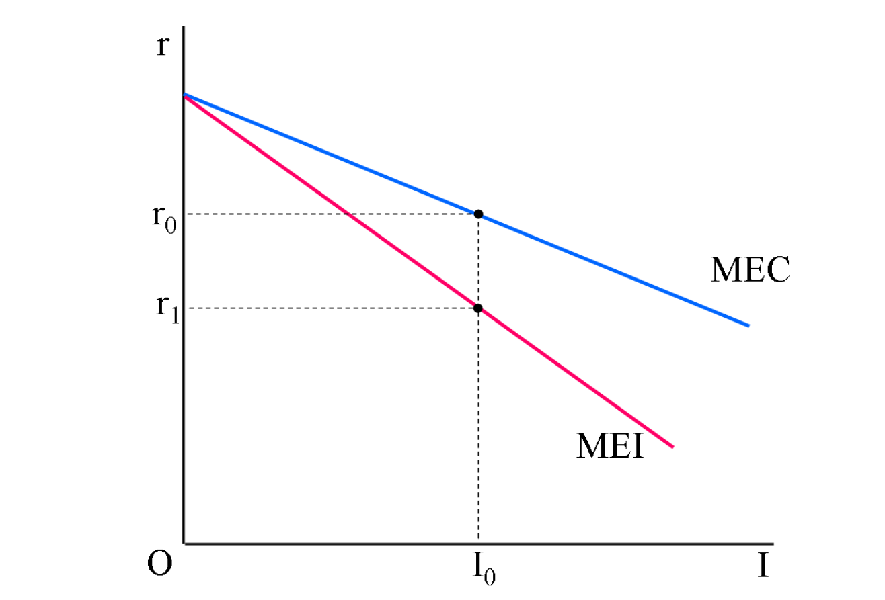

#### 投资和利率
利率是影响投资的首要因素

名义利率：借贷者所支付的利率
实际利率：大致上等于名义利率-通货膨胀率

投资是利率的减函数
$I = I(r) = e - dr$
> e：自主投资 ， d：投资系数 ， r：利率

### 三部门经济中国民收入的决定

#### 政府需求的内容
以政府购买的形式出现，是各级政府购买物品和劳务的支出
- 政府维持自身正常活动锁设计的消费需求
- 政府为满足自身或公共设施建设等需要所产生的投资需求

#### 政府对消费需求和投资需求的影响
- 直接支出的影响
- 税收的影响
- 转移支付的影响
- 制度和政策的影响

### 四部门经济中国民收入的决定
国外需求是总需求的重要组成部分
决定因素
- 国外收入水平
- 国外消费倾向
- 国外的消费结构
- 汇率、贸易竞争程度、保护主义强弱

#### 净出口
本国对国外的产出也有需求，因此真正对本国总需求其作用的是本国的净出口
$NX = 本国出口-进口$

### 乘数原理
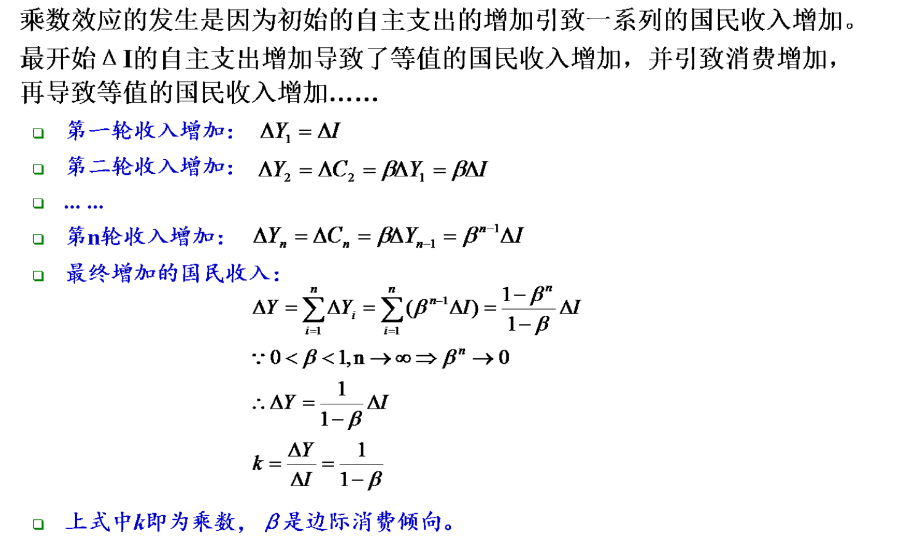

#### 两部门模型
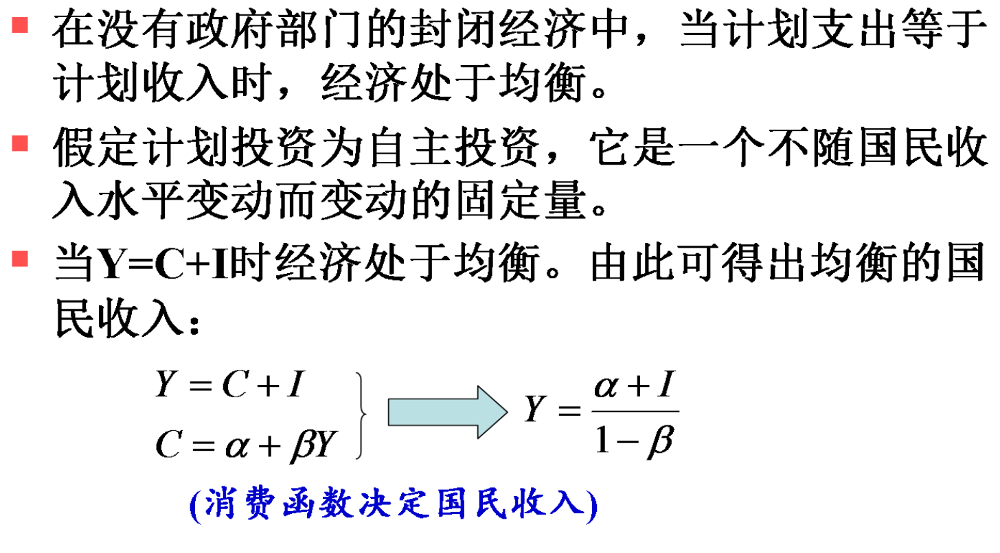

$Y = \frac{\alpha + I}{1-\beta}$

消费乘数 $k_c = \frac{\mathrm{d}Y}{\mathrm{d}\alpha} = \frac{1}{1-\beta}$

投资乘数  $k_I = \frac{\mathrm{d}Y}{\mathrm{d}I} = \frac{1}{1-\beta}$

#### 三部门经济
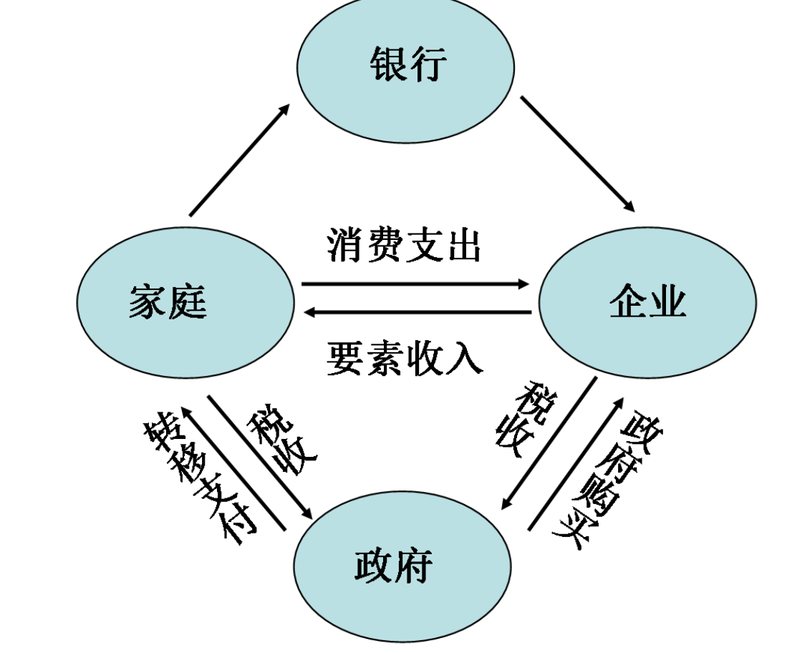

总支出 ： $AE = C + I+G$
总收入 ： $Y=C+S+T$
均衡条件： $I+G=S+T$
I为自主投资，不随国民收入水平变动而变动
G是政府控制量，假设是一个常数
T有两种情况
- 定量税
- 比例所得税，随收入增加而增加

三部门经济：定量税为$T_0$
消费函数:$C = \alpha + \beta (Y - T_0)$
均衡收入：
$Y = \frac{\alpha+I+G-\beta T_0}{1-\beta}$
#### 三部门经济：政府转移支付
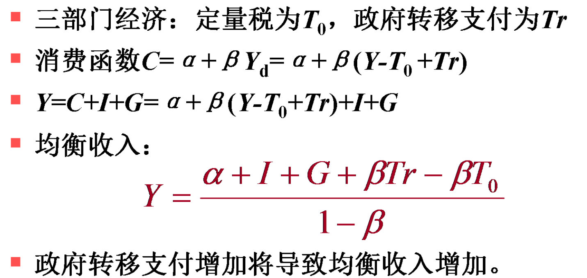

相关乘数
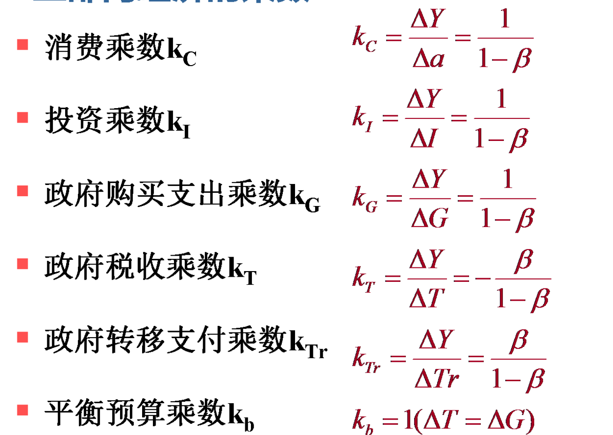

#### 三部门经济：比例税

#### 四部门经济模型
四部门：家庭、企业、政府、对外贸易部门
总支出：$AE = C+I+G+(X-M)$
均衡条件：$Y=C+I+G+(X-M) = C+S+T$

计算和上面差不多
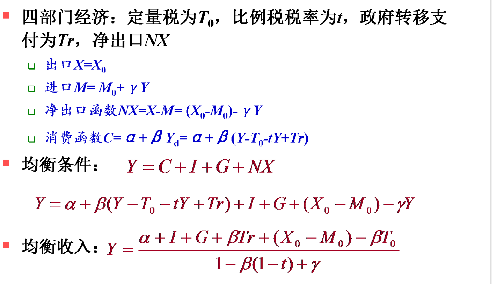
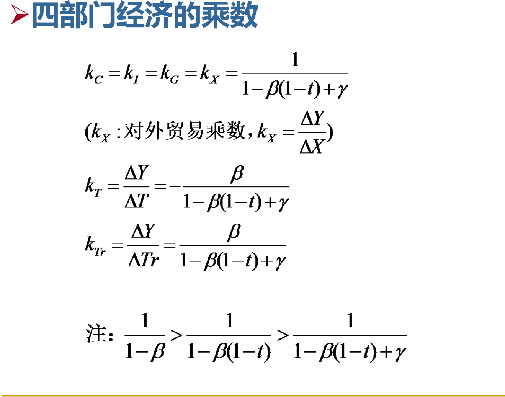

## Chapter 3 : 国民收入的决定： IS-LM模型

### 产品市场的均衡：IS曲线

产品市场的均衡指产品市场上总供给和总需求相等：

两部门：$C+I = C +S$

三部门：$C+I+G = C+S+T$

当投资取决于利率的时候，不同利率将决定不同的均衡收入。

在两部门经济中,$S=S(Y)$,$I=I(r)$,均衡时候由$I = S$所决定。

#### IS曲线的推导

$$
I = S
\\I = e-dr
\\S = -\alpha +(1-\beta)Y
\\r = \frac{a+e}{d}-\frac{1-\beta}{d}Y
$$

#### IS曲线的经济含义

1. 在IS曲线上任何点都表示I = S
2. 总产出和利率之间存在着反向变化的关系

#### IS曲线的移动

- IS曲线的水平移动

  如果利率没有变化，由外生经济变量冲击导致总产出增加，可以视作原有的IS曲线在水平方向上向右移动

- 储蓄增加，均衡收入减少，IS曲线向左方移动

- 投资增加，均衡收入增加，IS曲线向右方移动

### 货币市场的均衡：LM曲线

凯恩斯经济学的利率决定观点：

- 认为利率由货币供求决定，而不是储蓄和投资共同决定
- 货币的总供给是外生的

#### 凯恩斯的货币需求理论

需求货币的产生于以下三种不同的冬季

1. 交易动机：交易性货币需求
2. 谨慎或预防动机：预防性货币需求
3. 投机冬季：投机性货币需求

#### 货币需求

交易性货币需求和预防性货币需求主要取决于人们的收入水平Y

投机性货币需求主要取决于利率r

货币总需求L可以概括为：

$L=L_1(Y) + L_2(r)$

线性货币需求函数

$L = L_1(Y)+L_2(r) = kY - hr$

#### 货币需求曲线

#### 货币供给

货币供给是一个存量概念，通常认为它是一个外生变量，大小和利率高低五官，因此它是一条平行于利率轴的直线

目前所有的讨论都是实际意义上进行的，实际货币供给 $m = M/P$

#### 利率的决定

货币的供给与货币需求的均衡决定市场均衡利率的大小。

- 当利率高于均衡利率的时候，货币需求小于货币供给，人们会把手中的货币换成有价证券，利率下降

因此在现代货币市场中，政府可以根据自己的目的来调控市场利率水平

#### 货币需求与供给变动

- 对货币的交易需求或投机需求增加时，货币需求曲线就会向右上方移动；货币供给量增加时，货币供给曲线则会向右移动
- 当利率降到一定程度，货币需求曲线接近水平状态（**流动偏好陷阱**),货币供给曲线的右移并不能使利率下降

#### LM曲线的推导

$$
\\ L = L_1(Y) + L_2(Y) = kY - hr
\\ m = M/P
\\L = m
\\kY-hr = m
\\r  = -\frac{m}{h} +\frac{k}{h}Y
\\E=-\frac{m}{h},F = \frac{k}{h}
\\r = E+FY
$$

- LM曲线上任何一点都表示L=M
- 在LM曲线右边，表示L>M，现行利率水平过低

### IS-LM模型

$$
\\I(r)=S(Y)
\\L_1(Y) + L2(r) = m
$$

### 总结：凯恩斯理论框架

## Chapter 4 ： 国民收入的决定：AD-AS模型

### 1. 总需求曲线及其变动

- 总需求曲线的含义和相关效应

- 总需求曲线的推导
- 总需求曲线的变动和影响

#### 总需求曲线

总需求(Aggregate Demand , AD)反映了产出需求和价格总水平之间的关系.

**实际GDP**取决于四个因素：消费、投资、政府购买和经出口

$Y = C+I+G+NX$

#### 数理推导

- IS曲线方程： $r = \frac{a+e}{d} - \frac{1-\beta}{d}Y$
- LM曲线方程：$r\stackrel{P\neq1}{\longrightarrow}r = -\frac{1}{h}*\frac{M}{P} + \frac{k}{h}Y$

- IS = LM

  

#### 总需求曲线的移动和影响

- 在价格水平不变时

  - 扩张性财政政策：总需求曲线右移
  - 紧缩性财政政策：总需求曲线左移
  - 扩张性货币政策：总需求曲线右移
  - 紧缩性货币政策：总需求曲线左移

  

- 扩张性的货币政策

中央银行增加货币供给，M$\uparrow$

$\Longrightarrow$LM下移动

$\Longrightarrow$r$\downarrow$

$\Longrightarrow$I$\uparrow$

$\Longrightarrow$Y$\uparrow$

- 扩张性的财政政策

政府减少税收或增加政府支出的时候

IS右移

r上升

Y增加

### 2.总供给曲线及其变动

1. 总供给曲线的含义
2. 总供给曲线的推导
3. 总供给曲线的变动和影响
4. 特殊的总供给曲线及其变动
5. 总供给曲线不同特征的经济含义

#### 总供给的概念

- 总供给是指一定时期内整个社会的总产量（总产出），商品和劳务总量的和
- 总产量取决于技术水平、资本存量和劳动的投入量
- 总供给函数表示Y与价格水平P之间的函数关系
- 价格水平影响实际工资，再影响实际就业量，进而影响总产量
- **货币工资在长期中有伸缩性，但在短期具有下降刚性**，因此AS曲线可以分为：
  - 长期总供给曲线
  - 短期总供给曲线

#### 总量生产函数

- 是总投入和总产出之间的关系

如果经济中可能的就业量为**N**，可能的资本量为**K**，那么生产函数
$$
Y=f(N,K)
$$
短期中，假设资本不变
$$
Y = Y（N ，\bar{K})
$$

#### 潜在就业量与潜在产量

- 潜在就业量（充分就业量）
  - 所有愿意工作的人都能得到工作
- 潜在产量
  - 

#### 劳动市场的均衡

劳动市场上，劳动需求来源于厂商的引致需求，实际上是实际工资的减函数

而劳动供给来源于劳动者在闲暇和收入之间进行的最优选择，它也是实际工资的函数.

劳动市场均衡

#### 长期总供给曲线

古典模型对经济长期行为的描述，生产的产出取决于固定的资本和劳动量以及可以获得的技术。古典经济学家认为，**货币工资具有完全的伸缩性**，至少长期必然存在

- 长期中，实际产出主要由充分就业数量的生产要素锁决定，产出独立于价格水平
- 旨在影响总需求的财政政策和货币政策，只能使价格水平变化，不能对产量发生影响，

#### 短期总供给曲线

- 劳动者注重本身劳动的工资，具有**货币幻觉**，厂商注重价格
- 有货币工资**下降刚性**，只能升高不能降低

#### 凯恩斯主义总供给曲线的特殊形式：水平线

#### 一般形式的AS曲线

#### 总供给曲线不同特征的经济含义

### 总需求与总供给平衡

- 总需求和总供给相等决定均衡的价格总水平和收入
- 

### 宏观均衡的决定：AD-AD模型

- 充分就业状态
  - 总需求增加导致通货膨胀
- 经济萧条状态
  - P较低，有失业
- 经济过热，通货膨胀
  - P较高，无失业
- 滞胀
  - 总需求不变的情况下，总供给减少

#### AD曲线右移：经济增长与通货膨胀

- 消费和投资扩大，政府购买增加、出口增加、货币供给增加

#### AD曲线左移：经济衰退与通货紧缩

#### AS曲线右移：创新与增长

- 主要原因：技术进步
- 垂直段在横轴上的投影意味着一个国家在现有资源和技术条件下生产可能性边界。因而AS曲线向右移动意味着一个国家的生产能力增强

#### AS曲线左移：衰退与通货（滞胀）

- 主要原因：生产要素价格上升

### 三个模型之间的关系

## Chapter 5 : 失业、通货膨胀和经济周期

### 失业

失业指处于劳动年龄阶段、具有劳动能力、且具有工作意愿的劳动者找不到工作岗位的情况

#### 衡量失业/就业状况的指标

劳动力人口数=就业人数+失业人数

失业率 = $\frac{失业人数}{劳动力人口数} \times 100\%$

就业率 = $\frac{就业人数}{劳动力人口数} \times 100\%$

劳动力参与率 = $\frac{劳动力人口数}{劳动年龄人口数}\times 100\%$

#### 失业的宏观经济学解释

有效需求：商品总供给和总需求达到均衡状态时候的社会总需求

自然失业率：在没有货币干扰下，劳动力市场和商品市场的自发供求力量发挥作用时，应有的处于平衡状态下的失业率

#### 奥肯定律

- 失业与产出之间存在反向变动关系
- $\frac{Y-Y_f}{Y_f} = -\alpha(u-u^*)$
  - Y代表实际产出，$Y_f$代表潜在产出，
  - u为实际失业率，$u^*$为自然失业率

### 通货膨胀

通货膨胀：指经济体在一定时期内价格水平普遍而持续地上升

- 物价总水平上升
- 持续一段时间

通货膨胀率：

P可以使用消费价格指数（CPI），也可以用生产者价格指数（PPI），国内生产总值平减指数（IPD）

GDP平减指数=$\frac{以现期价格计算的GDP}{以基期价格计算的GDP}$

#### 通货膨胀的类型

按照程度

- 爬行
- 加速
- 超速

按照预料程度

- 未预期型
- 预期型

#### 需求上拉型通货膨胀

#### 成本推动型通货膨胀

#### 货币主义学派的通货膨胀解释

$MV=PT$

$货币供给量\times货币流通速度=价格水平\times 价格量$

#### 产出效应

- 增加生产和就业

  - 未预期：物价水平的上涨速度高于货币工资的增长速度，生产者获得更多利润，从而增产
  - 预期：生产者不能增加利润，但会刺激现期消费

- 前提条件

  - 需求拉动
  - 闲置资源存在
  - 温和的通货膨胀

  

#### 菲利普斯曲线的三种表达方式

- 原始表达
- 

- 修改的菲利普斯曲线

​	

- 附加预期的菲利普斯曲线（短期菲利普斯曲线）

人们根据最近观察到的通货膨胀率来形成他们的预期

因此在短期中，引起通货膨胀的扩张性财政政策和货币政策仍然可以起到减少失业的作用。

- 长期菲利普斯曲线

是一条垂直的直线，人们预期的通货膨胀率和实际迟早会一致，这时候工人要求改变名义工资以保持实际工资不变，因此维持较高的通货膨胀率不会起到作用。

#### 停滞膨胀

生产停滞、失业增加和物价水平居高不下，GDP增长缓慢，通货膨胀率一般超过5%

### 经济周期

